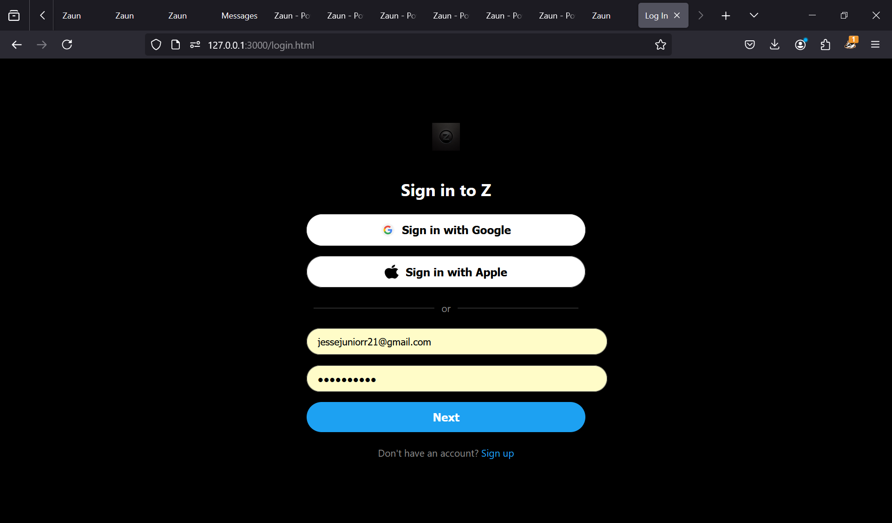

# Zaun: A Micro-Blogging Website

**Zaun** is a micro-blogging platform where users can post short, impactful messages and connect through the power of words.

---

## Table of Contents
1. [Overview](#overview)  
2. [Features](#features)  
3. [Screenshots](#screenshots)  
4. [Installation](#installation)  
5. [Usage](#usage)  
6. [Contributing](#contributing)  
7. [License](#license)

---

## Overview

Zaun embraces simplicity and community. Users can create accounts, share posts, and explore conversations from people around the world. With an emphasis on brevity, each post encourages clear, powerful expression—bringing voices together under one virtual roof.

---

## Features

- **User Authentication**: Sign up, log in, and manage profiles.  
- **Post Creation**: Share short posts that capture big ideas.  
- **Video Background**: A cinematic background video to enhance the homepage aesthetics.  
- **Responsive UI**: Works seamlessly on desktop, tablet, and mobile devices.  
- **Real-time Updates**: Posts appear instantly (depending on backend setup).  
- **Scroll Animation**: Smooth fade-in sections for a dynamic user experience.

---

## Screenshots

Below are six screenshots demonstrating key parts of the app. Replace `path/to/imageX.png` with the actual paths or URLs to your images.

1. **Home Page (Hero Section)**  
     
   _Shows the homepage with a background video and tagline._

2. **User Sign-Up**  
     
   _Simple registration form allowing new users to join Zaun._

3. **User Login**  
     
   _Secure login page with username and password fields._

4. **Main Feed**  
     
   _Displays posts from all users, showcasing short and impactful messages._

5. **Create New Post**  
     
   _User can type a short message and publish it instantly._

6. **Profile Page**  
     
   _View and edit profile information; see user’s own posts._

---

## Installation

1. **Clone the Repository**  
   ```bash
   git clone https://github.com/yourusername/zaun.git
   cd zaun
